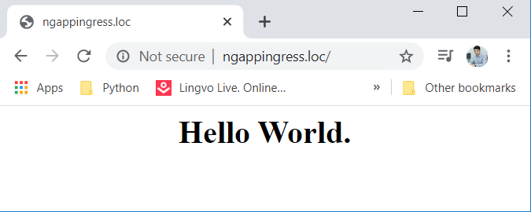
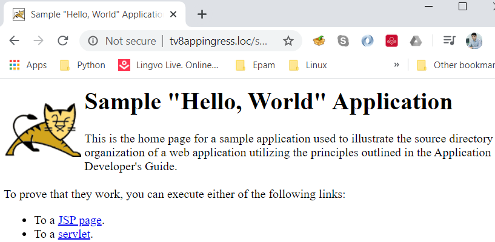
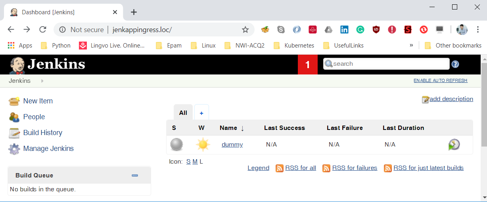

##### If you want to deploy applocations inside of the Kubernetes cluster first of all we must prepate nginx ingress controller itself. By default `kube-apiserver` port ragne is between `30000 - 32767`. If our purpose to expose port 80 and 443 to our worker nodes and use a lot of applications with the different DNS names (Like as VirtualHost) then, we must change this range. That is why inside of the master nodes we will edit `/etc/kubernetes/manifests/kube-apiserver.yaml` file and add `- --service-node-port-range=1-32767` line to change port range. 
`Note:` We must restart `kube-apiserver` services in the master nodes.

##### Create new `namespace` for our Ingress controller
```bash
$ kubectl create namespace ingress
```
##### Create deployment and service for the Nginx ingress controller to get healtch `/healthz` check from port  `8080` in the `ingress` namespace.
```bash
$ kubectl create -f default-backend-deployment.yaml -f default-backend-service.yaml -n=ingress
```

##### Inside the `ingress` namespace create new `configmap` which will be used inside the `nginx-ingress-controller`:
```bash
$ kubectl create -f nginx-ingress-controller-config-map.yaml -n=ingress
```

##### Create new RBAC to get access to the API endpoints for our *ServiceAccount* with name `nginx` which will be used in the `nginx-ingress-controller` Deployment.
```bash
$ kubectl create -f nginx-ingress-controller-roles.yaml -n=ingress
```

##### Now create `nginx-ingress-controller` which will use app `nginx-ingress-lb` inside `nginx-ingress` service. It will select `default-backend` service, configmap and *ServiceAccount* `nginx` which we created before.
```bash
$ kubectl create -f nginx-ingress-controller-deployment.yaml -n=ingress
```

##### Create Ingress rule to health check of controller itself:
```bash
$ kubectl create -f nginx-ingress.yaml -n=ingress
``` 

##### At the end just execute the following command to create service with name `nginx-ingress` which exposes port `80` to our ingress controller which mapped our ingress rule in the port `8080`.
```bash
$ kubectl create -f nginx-ingress-controller-service.yaml -n=ingress
```

##### Create our nginx app with the following command (It will create `ngapp` deployment with the selection of `ngapp` conatiner and with the 3 pod replicas. Then it will create the service with name `ngapp-service` which matchs to the created deployment `ngapp`):
```bash
$ kubectl create -f ngapp.yaml
```

`Note:` To use `ngappingress.loc` and `tv8appingress.loc` DNS names (which defined in the `ngappingress.yaml` for nginx and `tv8appingress.yaml` file for the tomcat application) we must add new zones to our DNS server with the `A` records for our worker nodes. Otherwise we must add DNS name with the IP addresses of worker nodes to the `c:\windows\system32\drivers\etc\hosts`(For the windows Desktop) or `/etc/hosts` (For the Linux Desktop file) file.

##### Create new `ngapp-ingress` Ingress with name which matchs to our `ngapp-service` service which listen on the port `80`. As the external DNS name we must use `ngappingress.loc`.
```bash
$ kubectl create -f ngappingress.yaml
```

`Note:` If you want use Tomcat app inside of the Kubernetes cluster, just execute `kubectl create -f tv8pod.yaml` and `kubectl create -f tv8appingress.yaml` commands. I have used DNS name `tv8appingress.loc`

`Note:` If you want to deploy Jenkins to your cluster with the multiple POD replicas then you must configure GlusterFS or Ceph disk sharing between worker nodes. Otherwise DNS loadbalancer will balancer load between nodes and the Jenkins data will be different in the different worker nodes. That is why I have created POD (It is possible to define `NodeSelector`) and created A record to this POD with the DNS name `jenkappingress.loc`. Just execute `kubectl create -f jenkpod.yaml` and `kubectl create -f jenkappingress.yaml` commands and then open `jenkappingress.loc` DNS name in the web browser (Please look at the result in the end of this documentation).

##### Result must be like as the following:
```bash
$ curl -XGET http://ngappingress.loc/
<html>
<center>
    <h1>
        Hello World.
    </h1>
</center>
</html>

$ curl -s -XGET http://tv8appingress.loc/sample/ | head -n3 | tail -n1
<title>Sample "Hello, World" Application</title>
```

##### Or:





